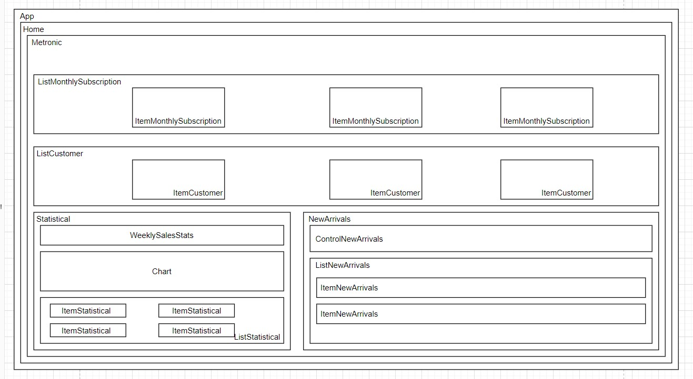

# KMS TEST ASSIGNMENT

## Core Folder and purpose

components - contains all components
less - Writing less's code
pages - Routing and API
public - Contains images
sass - Writing sass's code
src - Contain theme.tsx the file that used to custom CSS from React Material UI
styles - Contain global.css

### Another

utils - Folder used to test some stuff
bugs.txt - All problem that I met
components remnants - Break the UI into A Component Hierarchy

